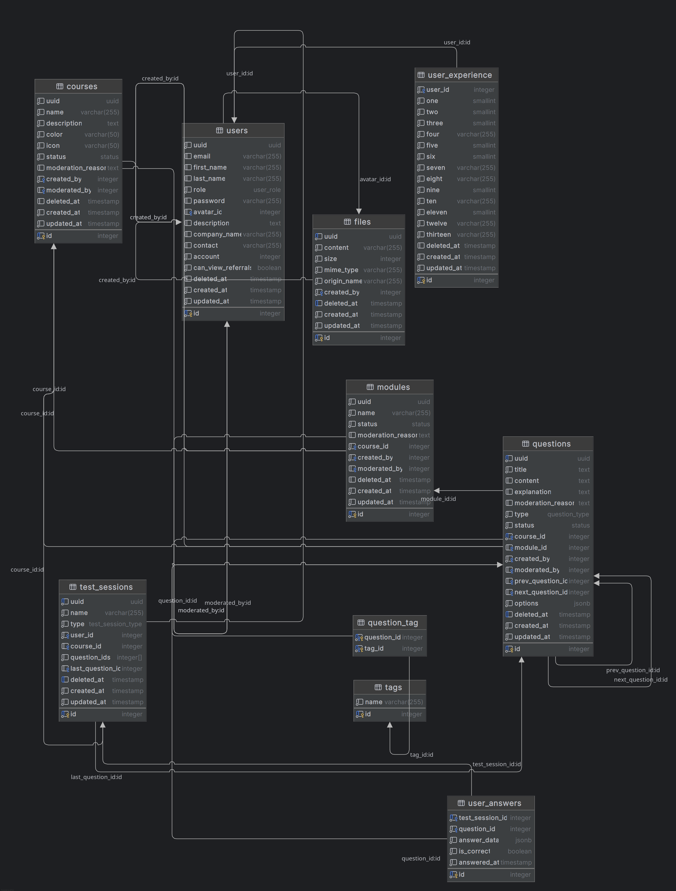

# Проектирование автоматизированной системы

Проектирование автоматизированной системы для сервиса по подготовке к собеседованиям.

## Описание

Этот репозиторий создан, чтобы сделать итоговое домашнее задание по предмету «Базы данных».
В рамках этого домашнего задания необходимо спроектировать базу данных, создать несколько диаграмм и описать процессы.
В качестве СУБД я выбрал Postgres 18 версии и описал в файле [compose.yaml](./compose.yaml) инструкцию для запуска с помощью команды `docker compose up -d`.
В файле [scheme.sql](./scheme.sql) я описал схему базы данных для проекта по подготовке к собеседованиям.

## ER-диаграмма

## Краткое описание возможностей в проекте по подготовке к собеседованиям

1. Создавать курсы.
2. Создавать модули к курсу.
3. Регистрироваться и аутентифицироваться.
4. Создавать вопросы к курсу и модулю.
5. Проходить опросы (отвечать на вопросы) по курсу в нескольких форматах: все вопросы по курсу, все вопросы по модулю, все вопросы по курсу вперемешку, все вопросы по заданную тегу.
6. Возможность прикреплять теги к вопросу, примеры тегов: фронтенд, бэкенд, мобильная разработка и так далее.
7. Возможность загружать файлы, таблица `files`.
8. Возможность оставлять обратную связь через анкету для сбора обратной связи, таблица `user_experience`.
9. Возможность подбора кандидата по метрикам по итогу ответов на вопросы.
10. Несколько ролей: обычный пользователь (проходит курсы, отвечает на вопросы), компания (для подбора кандидатов), модератор (может редактировать курсы, модули и вопросы), администратор (высшая роль).

## Описание домашнего задания от преподавателя

Проектирование автоматизированной системы

1) Выбор темы для выполнения большого домашнего задания, выбранная тема должна предполагать не менее трех бизнес-процессов.
2) Описание предметной области, должно включать в себя подробное описание процессов, происходящих в автоматизированной системе и на входе/выходе АС, описание сущностей, включенных в автоматизированную систему, описание аттрибутов этих сущностей, ограничение и правила хранения данных и особенностей реализации бизнес процессов.
3) Создание DFD-диаграммы, описывающей потоки данных.
4) Создание ER-диаграммы в любой удобной нотации, логическая и физическая модель данных, должна быть приведена к четвертой нормальной форме.
